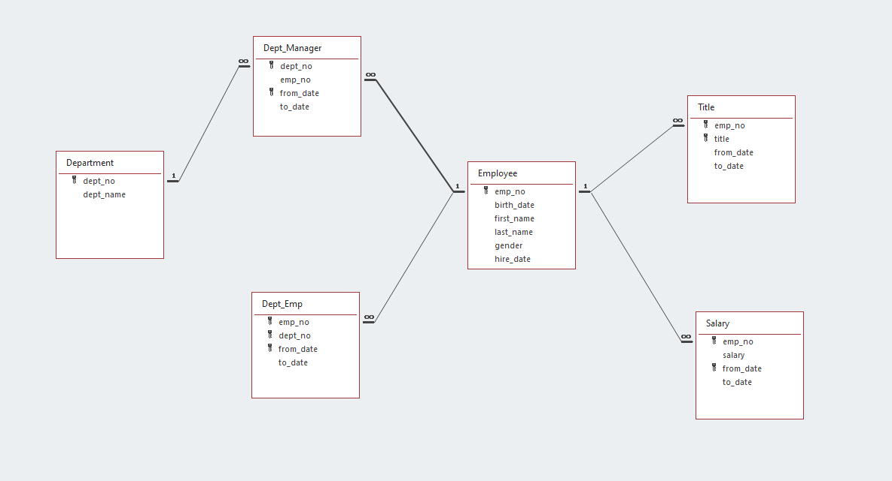

# Employees Database - SQL Exercise

## Background

It is a beautiful spring day, and it is two weeks since you have been hired as a new data engineer at Pewlett Hackard. Your first major task is a research project on employees of the corporation from the 1980s and 1990s. All that remain of the database of employees from that period are six CSV files.

In this assignment, you will design the tables to hold data in the CSVs, import the CSVs into a SQL database, and answer questions about the data. In other words, you will perform:

1. Data Modeling

2. Data Engineering

3. Data Analysis

## Entity Relational Model

The following ERD was generated based on the structure of data in the following csv files:  

-  departments.csv
-  dept_emp.csv
-  dept_manager.csv
-  employees.csv
-  salaries.csv
-  titles.csv
---

