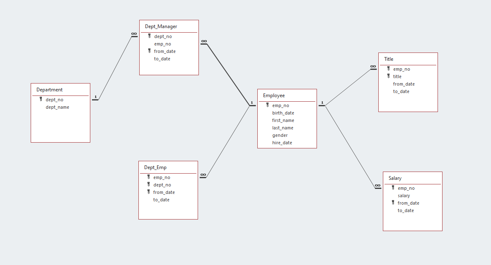

# Employees Database - SQL Exercise

## Background

It is a beautiful spring day, and it is two weeks since you have been hired as a new data engineer at Pewlett Hackard. Your first major task is a research project on employees of the corporation from the 1980s and 1990s. All that remain of the database of employees from that period are six CSV files.

In this assignment, you will design the tables to hold data in the CSVs, import the CSVs into a SQL database, and answer questions about the data. In other words, you will perform:

1. Data Modeling

2. Data Engineering

3. Data Analysis

## Entity Relational Model

The following ERD was generated based on the structure of data in the following csv files:  

-  departments.csv
-  dept_emp.csv
-  dept_manager.csv
-  employees.csv
-  salaries.csv
-  titles.csv
---

## Data Engineering
Using the ERD diagram as a guide, the following PostgreSQL database schema was generated to convert the model into a series of tables with correspondng PRIMARY KEYS, FOREIGN KEYS and other Constraints.   
<pre><code><blockquote>
-- create a container Database  
CREATE DATABASE PewlettHackard  </code></pre>
 
/* Scripts to generate tables  */  
 
 -- employees table  
DROP TABLE IF EXISTS employees  
CREATE TABLE employees(  
emp_no  SERIAL PRIMARY KEY,  
birth_date DATE,  
first_name VARCHAR(100) NOT NULL,  
last_name VARCHAR(100) NOT NULL,  
gender CHAR(1),  
hire_date DATE  
);  
 
-- titles table  
DROP TABLE IF EXISTS titles  
CREATE TABLE titles (  
emp_no	INT NOT NULL,  
title  VARCHAR(100) NOT NULL,  
from_date DATE NOT NULL,  
to_date DATE DEFAULT '1/1/9999',  
PRIMARY KEY (emp_no, title),  
FOREIGN KEY (emp_no) REFERENCES employees(emp_no)  
);  
 
-- salaries table  
DROP TABLE IF EXISTS salaries  
CREATE TABLE salaries (  
emp_no	INT NOT NULL,  
salary	int NOT NULL,  
from_date DATE NOT NULL,  
to_date DATE NOT NULL,  
PRIMARY KEY (emp_no, from_date),  
FOREIGN KEY (emp_no) REFERENCES employees(emp_no)  
);  
 
-- departments table  
DROP TABLE IF EXISTS  departments  
CREATE TABLE departments (  
dept_no SERIAL PRIMARY KEY,  
dept_name VARCHAR(100) NOT NULL  
 );  
 
-- dept_managers table  
DROP TABLE IF EXISTS dept_managers  
CREATE TABLE dept_managers (  
dept_no 	INT  NOT NULL,  
emp_no		INT NOT NULL,  
from_date	DATE NOT NULL,  
to_date		DATE DEFAULT '1/1/9999',  
PRIMARY KEY (dept_no, from_date),  
FOREIGN KEY (dept_no) REFERENCES departments(dept_no),  
FOREIGN KEY (emp_no) REFERENCES employees(emp_no)  
);  
 
-- dept_emp table  
DROP TABLE IF EXISTS dept_emp  
CREATE TABLE dept_emp (  
emp_no 	INT NOT NULL,  
dept_no INT NOT NULL,  
from_date DATE NOT NULL,  
to_date   DATE DEFAULT '1/1/9999',  
PRIMARY KEY (emp_no, dept_no, from_date),  
FOREIGN KEY (emp_no) REFERENCES employees(emp_no),  
FOREIGN KEY (dept_no) REFERENCES departments(dept_no)  
);  
</blockquote>

## Data Analysis
<blockquote>  

-- 1. List Employees with their Salaries  
SELECT e.emp_no, e.last_name, e.first_name, e.gender, s.salary  
FROM  employees e  
INNER JOIN salaries s  
ON e.emp_no = s.emp_no;  
  
-- 2. List of employees who were hired in 1986  
SELECT e.emp_no, e.last_name, e.first_name, e.gender, e.hire_date  
FROM  employees e  
WHERE EXTRACT(YEAR FROM e.hire_date) = 1986;  

-- 3. List the manager of each department: department number, department name, the manager's employee number, last name, first name, and start and end employment dates  
SELECT dm.dept_no, d.dept_name, dm.emp_no as "mgr_no", e.last_name as "mgr_last_name", e.first_name as "mgr_first_name", dm.from_date, dm.to_date  
FROM employees e  
INNER JOIN dept_managers dm  
ON e.emp_no = dm.emp_no  
INNER JOIN departments d  
ON d.dept_no = dm.dept_no  
WHERE dm.to_date = '9999-01-01';  
  
-- 4. List the department of each employee: employee number, last name, first name, and department name  
SELECT e.emp_no, e.last_name, e.first_name, d.dept_name  
FROM employees e  
INNER JOIN dept_emp de  
ON e.emp_no = de.emp_no  
INNER JOIN departments d  
ON d.dept_no = de.dept_no  
and de.to_date = (select max(to_date) from dept_emp where emp_no = e.emp_no);  
  
-- 5. List all employees whose first name is "Hercules" and last names begin with "B."  
SELECT emp_no, first_name, last_name  
FROM employees  
where lower(first_name) = 'hercules'  
AND LEFT(upper(last_name), 1) = 'B';  
  
-- 6. List all employees in the Sales department, including their employee number, last name, first name, and department name  
SELECT e.emp_no, e.last_name, e.first_name, d.dept_name  
FROM employees e  
INNER JOIN dept_emp de  
ON e.emp_no = de.emp_no  
INNER JOIN departments d  
ON d.dept_no = de.dept_no  
and de.to_date = '9999-01-01'  
and d.dept_name = 'Sales';  
  
-- 7. List all employees in the Sales and Development departments, including their employee number, last name, first name, and department name  
SELECT e.emp_no, e.last_name, e.first_name, d.dept_name  
FROM employees e  
INNER JOIN dept_emp de  
ON e.emp_no = de.emp_no  
INNER JOIN departments d  
ON d.dept_no = de.dept_no  
and de.to_date = '9999-01-01'  
and d.dept_name in ('Sales', 'Development');   
</blockquote>  
